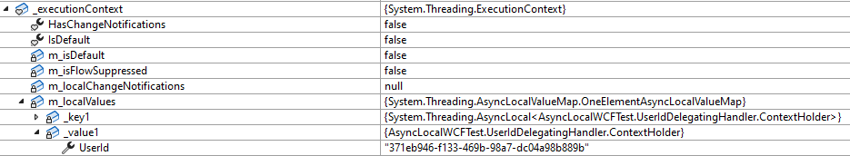
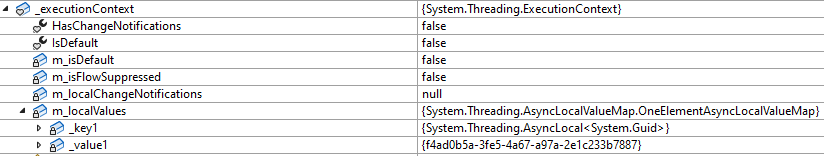
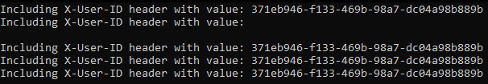

# Concurrency issue with WCF soap client.

This example demonstrates concurrency issue with inconsistent "flowing" of ExecutionContext in DelegatingHandler used in ServiceModel.ClientBase.
Following inconsistency happens at the first batch of requests after WCF client is initialized and it can be only seen if there are multiple requests processed concurrently at that time.  
  
Whenever there are some data stored in the ExecutionContext (like using AsyncLocal) it is expected that those will "flow" throughout the async/await chain. 
However there seems to be some inconsistency of this processing in ServiceModel generated proxy client and the flowing of ExecutionContext does not happen correctly in the first request.
DelegatingHandler is here registered using IEndpointBehavior's AddBindingParameters method:  
  
If the content of the ExecutionContext is examined in the DelegatingHandler we can see following results:  
First request - there are correctly passed data from the initial ExecutionContext thas is modified via AsyncLocal:  

  
Second and every other request processed simultaneously with the first one:
  
The value of ContextHolder is replaced with some Guid and the original ExecutionContext data are lost.  
  
 
From this point any further requests correctly "flows" the ExecutionContext until the soap client is recreated:
 

It seems that this is fairly consistent behavior and it is happening only during the first batch of requests performed concurrently.  
However, there is no easy workaround for this because delegating handlers do not respect the scoped lifetime in DI (as seen [here](https://stackoverflow.com/a/53227006)) 
and also, HttpContextAccessor is using the ExecutionContext that does not flow correctly in the first batch of requests done simultaneously.